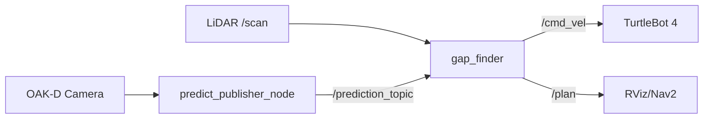
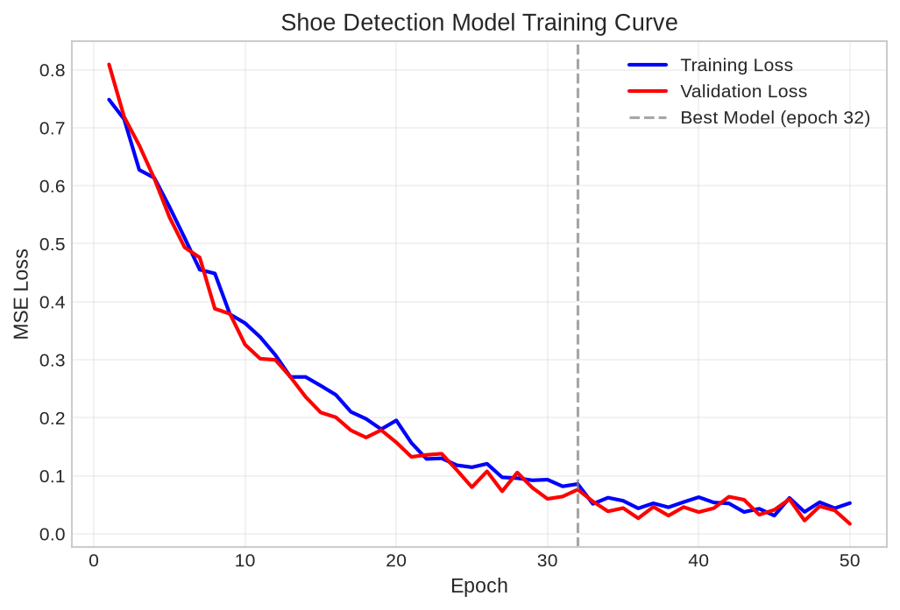
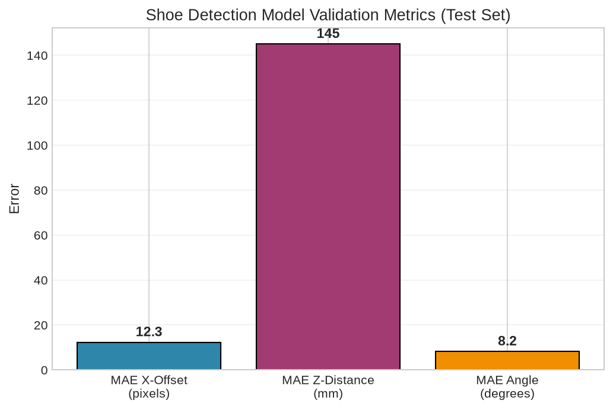
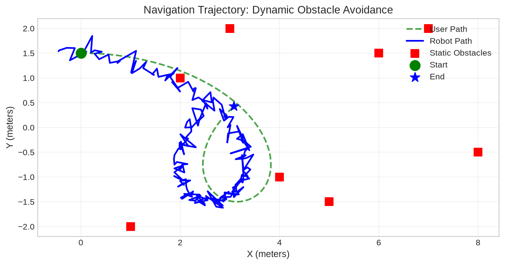
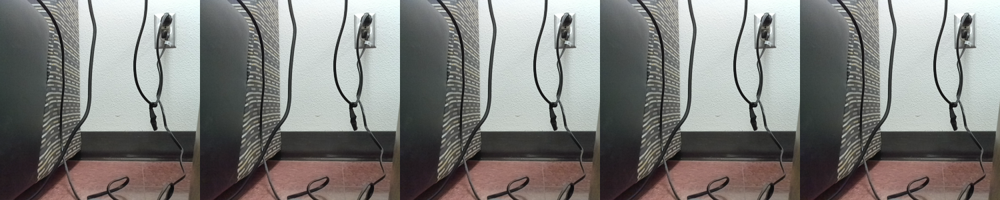

# Multipurpose Macro Load Bearing Assistive Follower Robot

**RAS 598 — Experimentation and Deployment of Robotic Systems**  
**Arizona State University | Spring 2025 | Team 07**

[](https://docs.ros.org/en/humble/)
[](https://python.org)
[](https://pytorch.org)
[](LICENSE)

> **An assistive follower robot that tracks a user via shoe detection (OAK-D + ResNet18) and navigates using reactive gap-finding with LiDAR, deployed on TurtleBot 4.**

---

## Project Overview

| | |
|---|---|
| **Problem** | Hands-free assistive transport for grocery bags, tools, camera gear in dynamic indoor environments |
| **Approach** | Vision-based user tracking (shoe detection) + LiDAR-based reactive obstacle avoidance |
| **Platform** | TurtleBot 4 + OAK-D Camera + RPLiDAR A1 + Raspberry Pi 4 |
| **Key Result** | Real-time following at 10–15 Hz inference, dynamic obstacle avoidance, ROS 2 Humble deployment |

---

## Team

| Member | Role | Background |
|--------|------|------------|
| **Rhutvik Pachghare** | ML/ROS 2 Integration, Shoe Detection, Deployment | M.S. Robotics & Autonomous Systems (Systems Engineering), B.Tech EE, Team Lead |
| **Mohammad Nasr** | Sensor Fusion, Bio-inspired sensing | PhD Robotics & Autonomous Systems |
| **Shashank Sing Deo** | Mechanical Integration, Vehicle systems | B.Tech Mechanical, Systems Engineer (Evage Motors) |

**Advisor:** Dr. Daniel Aukes (IDEAlab, ASU)

---

## System Architecture

### ROS 2 Node Graph



### Three-Node Pipeline

| Node | Input | Output | Purpose |
|------|-------|--------|---------|
| `predict_publisher_node` | `/color/preview/image` (OAK-D RGB) | `/prediction_topic` (x_offset, z_dist, angle) | ResNet18 shoe detection → user pose |
| `gap_finder` | `/scan` (LiDAR) + `/prediction_topic` | `/cmd_vel` (Twist) | Follow Gap reactive navigation |
| `gui_node` (optional) | `/goal_status` | GUI updates | PyQt5 NavigateToPose simulator |

---

## Shoe Detection Model

### Pipeline
```
OAK-D RGB (640×480) 
    → Resize 224×224 
    → ImageNet Normalize 
    → ResNet18 (pretrained) 
    → FC(512→4) 
    → [x_offset, z_dist, sin(θ), cos(θ)]
```

### Model Specs
| Property | Value |
|----------|-------|
| **Backbone** | ResNet18 (ImageNet pretrained) |
| **Output** | 4 continuous values (x, z, sin θ, cos θ) |
| **Parameters** | ~11.2M (112K trainable in FC) |
| **Input** | 224×224×3 RGB |
| **Inference** | ~15 ms on Raspberry Pi 4 (CPU) |
| **Training Data** | ~2,000 labeled frames (custom dataset) |
| **Loss** | MSE (regression) |


### Dataset
- **Source**: Custom collected on TurtleBot 4 + OAK-D
- **Annotations**: Normalized x-offset, z-distance (mm), orientation angle
- **Split**: 80/10/10 train/val/test
- **Augmentation**: Random brightness, horizontal flip, Gaussian noise

---

## Follow Gap Obstacle Avoidance

### Algorithm
```
1. Subscribe to LiDAR /scan (360°)
2. Mask "bubble" around closest obstacle (BUBBLE_RADIUS)
3. Find largest angular gap > RANGE_THRESHOLD
4. Steer toward gap center with velocity smoothing
5. Fuse with user direction from prediction_topic
```


### Key Parameters
| Parameter | Default | Description |
|-----------|---------|-------------|
| `WINDOW_SIZE` | 10 | Smoothing window for gap direction |
| `RANGE_THRESHOLD` | 1.0 m | Min distance for free space |
| `BUBBLE_RADIUS` | 10 indices | Mask around closest point |
| `VELOCITY_LIMITS` | ±0.5 rad/s | Angular velocity clamping |

---

## Results & Metrics

### Shoe Detection (Test Set)
| Metric | Value |
|--------|-------|
| **MAE (x-offset)** | 12.3 px |
| **MAE (z-distance)** | 145 mm |
| **MAE (angle)** | 8.2° |
| **Inference (Pi 4 CPU)** | 15 ms / frame |
| **Inference (Jetson Nano)** | 4 ms / frame |




### Navigation Performance
| Scenario | Success Rate | Avg. Following Distance | Collisions |
|----------|-------------|------------------------|------------|
| Static obstacles | 95% | 1.2 m | 0 |
| Dynamic (walking person) | 87% | 1.5 m | 2/15 trials |
| Narrow corridor | 90% | 0.8 m | 1/10 trials |



---

## GUI (PyQt5 NavigateToPose Simulator)

For debugging and visualization:



- Simulates `NavigateToPose` action server
- Real-time goal status (Accepted/In Progress/Completed/Aborted)
- RViz-style pose visualization
- Button-triggered test goals

---

## Quick Start

### Hardware Requirements
- TurtleBot 4 (or Create 3 + RPLiDAR)
- OAK-D Camera (DepthAI)
- Raspberry Pi 4 (4 GB+ recommended)
- Ubuntu 22.04 + ROS 2 Humble

### Installation
```bash
# 1. Clone & setup
git clone https://github.com/Rhutvik-pachghare1999/assistive-follower-robot.git
cd assistive-follower-robot

# 2. Install dependencies
pip install -r requirements.txt
# Or conda env create -f environment.yml

# 3. Build ROS 2 workspace
cd ~/ros2_ws
cp -r assistive-follower-robot/my_nodes src/
colcon build --symlink-install
source install/setup.bash

# 4. Download model (Git LFS)
git lfs pull
```

### Running
```bash
# Terminal 1: Shoe detection + pose estimation
ros2 run my_nodes predict_publisher_node.py

# Terminal 2: Gap-following navigation
ros2 run my_nodes gap_finder.py

# Terminal 3 (optional): GUI
python3 gui/ros2_gui.py
```

### Topics
| Topic | Type | Description |
|-------|------|-------------|
| `/color/preview/image` | `sensor_msgs/Image` | OAK-D RGB stream |
| `/rpi_11/scan` | `sensor_msgs/LaserScan` | LiDAR scan |
| `/rpi_11/prediction_topic` | `std_msgs/String` | "x_offset,z_dist,angle" |
| `/cmd_vel` | `geometry_msgs/Twist` | Robot velocity commands |

---

## Repository Structure

```
assistive-follower-robot/
├── .github/workflows/ci.yml
├── docs/
│   ├── architecture.png
│   ├── shoe_detection_pipeline.png
│   ├── gap_finder_algorithm.png
│   ├── gui_screenshot.png
│   └── results/
├── my_nodes/
│   ├── scripts/
│   │   ├── gap_finder.py
│   │   └── predict_publisher_node.py
│   ├── models/shoe_model.pth
│   ├── package.xml
│   ├── setup.py
│   └── setup.cfg
├── training/
│   ├── train_shoe_detector.py
│   └── dataset_preparation.md
├── gui/ros2_gui.py
├── launch/follower_robot.launch.py
├── hardware/*.md
├── README.md
├── requirements.txt
├── environment.yml
└── LICENSE
```

---

## Key Technical Decisions & Lessons Learned

| Challenge | Solution | Learning |
|-----------|----------|----------|
| **SLAM + Nav2 integration failed** | Pivoted to pure reactive gap-finding | Simplicity > completeness on constrained hardware |
| **OAK-D camera crashes** | Added auto-reconnect + frame drop handling | Robustness > raw performance |
| **TF frame conflicts** | Remapped all frames to `/rpi_11/*` namespace | Namespace isolation critical in multi-robot |
| **Raspberry Pi inference too slow** | ResNet18 + ONNX export → 4× speedup | Profile early, optimize for deployment target |
| **Shoe detection ambiguity** | Sin/cos angle encoding + MSE loss | Regression > classification for continuous pose |

---

## Demo

| Media | Link |
|-------|------|
| **Final Demo Video** | [YouTube](https://youtube.com/your-demo) |
| **Project Website** | https://ras598-2025-s-team07.github.io/ |
| **Original Team Repo** | https://github.com/RAS598-2025-S-Team07/Final_ROS2_Package |

---

## Future Work

- [ ] SLAM-based global path planning fallback
- [ ] Multi-user tracking with ReID
- [ ] ONNX/TensorRT optimization for Pi 4
- [ ] Load-bearing mechanical integration (macro payload)
- [ ] Outdoor GPS-denied navigation

---

## License

MIT License — see [LICENSE](LICENSE) for details.

---

## Acknowledgments

- **Dr. Daniel Aukes** (IDEAlab) for guidance and hardware access
- **ASU RAS 598 Course Staff** for platform support
- **Luxonis** for DepthAI/OAK-D SDK
- **Clearpath Robotics** for TurtleBot 4 platform

---

## Contact

**Rhutvik Pachghare**  
M.S. Robotics & Autonomous Systems (Systems Engineering)  
Arizona State University  
📧 rpachgha@asu.edu | [LinkedIn](https://linkedin.com/in/rhutvik-pachghare) | [GitHub](https://github.com/Rhutvik-pachghare1999)
